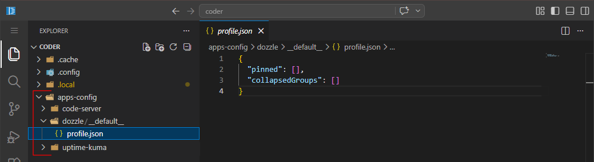

[← Back to the Main Menu](../../README.md)

# Code Server - installation and configuration

## Pre-requirements

Datasets and files structure:

```php
tank [POOL]
└─ apps [DATASET] # Dataset Preset: APPS
   ├─ compose [DATASET] # Dataset Preset: APPS
   │  ├─ code-server [DATASET] # Dataset Preset: APPS
   |  |  ├─ .env [FILE]
   |  |  ├─ compose.yaml [FILE]
   |  |  └─ metadata.yaml [FILE]
   |  |
   │  └─ shared [DATASET] # Dataset Preset: APPS
   │     └─ .env [FILE]
   │
   └─ configs [DATASET] # Dataset Preset: APPS
      └─ code-server [DATASET] # Dataset Preset: APPS
```
In my case, the datasets have the APPS preset because I'm running this Docker container as the user/group: Apps/Apps (568/568).  
If you use a different user or group in the container, remember to set the appropriate ACLs for the above datasets.

You can create the this datasets structure manually or you can use my [create-datasets script](../../docs/datasets-creation.md#creating-datasets-automatically).  
If you use the script, here is the list of dataset to create:
```
tank/apps/compose/code-server
tank/apps/compose/shared
tank/apps/configs/code-server
```
<br />

**Here is the example of the `tank/apps/compose/shared/.env` file:**  
[compose/shared/.env](../shared/.env.example)

**Here is the example of the `tank/apps/compose/code-server/.env` file:**  
[compose/code-server/.env](./.env.exmpale)

**Here is the `tank/apps/compose/code-server/compose.yaml` file:**  
[compose/code-server/compose.yaml](./compose.yaml)

**Here is the `tank/apps/compose/code-server/metadata.yaml` file:**  
[compose/code-server/metadata.yaml](./metadata.yaml)

## Installing Code Server

Open TrueNAS `Apps` page.

Press the `Discover Apps` button.

Press the `More Options` button (the `⠀⋮⠀` icon), located to the right of the `Custom App` button.

Select the `Install via YAML` option.

In the `Name` field, enter: `code-server`.

In the `Custom Config` field, enter:
```yaml
include:
  - env_file:
      - /mnt/tank/apps/compose/shared/.env
      - /mnt/tank/apps/compose/code-server/.env
    path: /mnt/tank/apps/compose/code-server/compose.yaml
```

## Updating TrueNAS metadata for the Code Server app

To display additional options and information for `Code Server` on the Apps page from the TrueNAS system, i.e. icon, link to Web UI, description, etc., it is necessary to edit the `/mnt/.ix-apps/app_configs/code-server/metadata.yaml` file.

Here is the metadata.yaml file for Code Server:  
[metadata.yaml](./metadata.yaml)

### Manually modifying the metadata.yaml file

You can simply edit the `metadata.yaml` file manually and update the properties you care about.  
Here's an example using nano:
```bash
sudo nano /mnt/.ix-apps/app_configs/code-server/metadata.yaml
```

> [!NOTE]
> By default, when you create a `Custom App` on the TrueNAS, it is version `1.0.0`.  
> If you specify a version other than `1.0.0` in the `metadata.yaml` file, you must also create a folder corresponding to that version in `/mnt/.ix-apps/app_configs/code-server/versions/`.  
> The easiest way is to simply copy the content from version `1.0.0`.  
> For example, if we set version `1.2.3`, the copy command will look like this:  
> ```bash
> sudo cp -r /mnt/.ix-apps/app_configs/code-server/versions/1.0.0/. /mnt/.ix-apps/app_configs/code-server/versions/1.2.3
> ```

### Automatic modification of the metadata.yaml file

You can also use my script, which simply requires passing the path to the metadata.yaml file that is to be used to overwrite the application metadata. By default, the application name is taken from the provided metadata.yaml file (from the `metadata.name` property), but if necessary, this can be changed by passing an additional argument to the script.

Here is a link to instructions on how to use this script:

[Update TrueNAS app metadata script](../../scripts/update-truenas-app-metadata/README.md)

Command example:
```bash
./update-truenas-app-metadata.sh -s /mnt/tank/apps/compose/code-server/metadata.yaml -e /mnt/tank/apps/compose/shared/.env -v 4.131.0
```

<br />

### To see updated data for `Code Server` on the TrueNAS `Apps` page

- open `Apps` TrueNAS page

- Find `code-server` app on the list and select it

- Press the `Edit` button

- Don't make any changes, just click the `Save` button.
  

## Access your location directory from Code Server

To access some directory from drive in Code Server you need to edit [/compose/code-server/compose.yaml](./compose.yaml).

Add additional entry under `volumes:` property:

```
- /mnt/tank/apps/config:/home/coder/apps-config
```

- Save changes.

- Got to TrueNAS `Apps` page.

- Find `Code Server` on the list and select it.

- Press the `Edit` button.

- Don't make any changes, just click the `Save` button.

This setting will cause the `/mnt/tank/apps/config` directory to be displayed as follows in Code Server: 



## My Code Server preferences and installed extensions

**My preferences:**
- Open `Settings`/`Workbench`/`Appearance`  
  - set `Color Theme` to `Dark (Visual Studio)`

**Installed Extensions:**
- YAML (Identifier: redhat.vscode-yaml)
- XML (Identifier: redhat.vscode-xml)
- Prettier - Code formatter (Identifier: esbenp.prettier-vscode)
- Code Spell Checker (Identifier: streetsidesoftware.code-spell-checker)
- TODO Highlight (Identifier: wayou.vscode-todo-highlight)
- vscode-icons (Identifier: vscode-icons-team.vscode-icons)
- GitLens (Identifier: eamodio.gitlens)
- shell-format (Identifier: foxundermoon.shell-format)
- IntelliJ IDEA Keybindings (Identifier: k--kato.intellij-idea-keybindings)


\___  <br />

[← Back to the Main Menu](../../README.md)